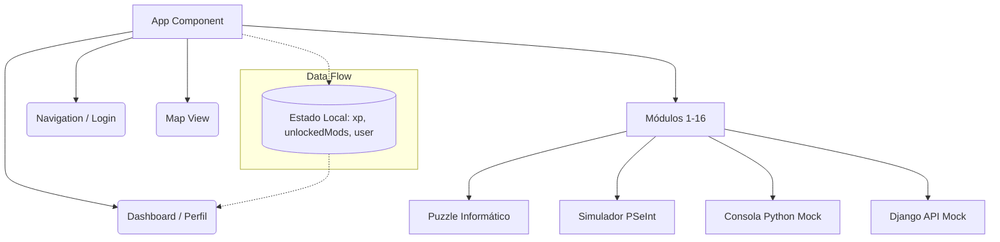

# LabCode: The Full-Stack Gamified Learning Platform

LabCode es una plataforma interactiva y gamificada diseñada para que los estudiantes del Máster de Desarrollo de Aplicaciones Full Stack repasen, apliquen y consoliden sus conocimientos.

## 🚀 Manual de Instalación y Uso

1. **Requisitos Previos:**
   - Node.js (v18+)
   - npm o yarn

2. **Instalación:**
   ```bash
   git clone <repo-url>
   cd conquer_game/frontend
   npm install
   ```

3. **Ejecución Local:**
   ```bash
   npm run dev
   ```
   Abre el navegador en `http://localhost:5173`. Ingresa con cualquier nombre de usuario al iniciar.

4. **Uso de la Plataforma:**
   - **Mapa:** Muestra todos los módulos (del 1 al 16). Se desbloquean secuencialmente.
   - **Módulos:** Cada módulo presenta un simulador (Terminal, PSeInt, Python, Git, DOM, Backend, etc.). Completa el objetivo técnico para continuar.
   - **Perfil (XP):** Haz click en tu nombre de usuario arriba a la derecha para ver tus insignias (badges) y tu nivel actual.

---

## 🏗️ Documentación Técnica y Arquitectura

El proyecto utiliza una arquitectura Frontend *Client-Side Rendereing (CSR)* moderna y escalable.

### Stack Tecnológico
- **Core:** React 18, TypeScript, Vite
- **Estilos:** Tailwind CSS, custom CSS theme variables
- **Routing:** Estado local en `App.tsx` (State-based routing) simplificado para simulación de vistas SPA rápidas y transiciones fluidas.
- **Testing:** (Planificado) Vitest + Testing Library

### Diagrama Conceptual de Arquitectura (Mermaid)



### Estructura de Componentes
- `src/App.tsx`: Orquestador principal de estado y renderizado condicional.
- `src/components/layout/Map.tsx`: Selector de niveles y validación de desbloqueo.
- `src/components/layout/Dashboard.tsx`: Motor de gamificación y cálculos de progreso de XP.
- `src/components/modules/`: Contiene `Module1.tsx` - `Module16.tsx`. Emuladores agnósticos que notifican a la `App` general vía `onComplete`.

## ⚙️ CI/CD & Despliegue

La integración y entrega continuas están preparadas vía **GitHub Actions** (`.github/workflows/deploy.yml`).
El pipeline:
1. Instala dependencias.
2. Construye el build de Vite (`npm run build`).
3. (Opcional) Despliega el output en GitHub Pages o Vercel automáticamente.
